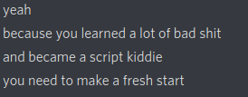

# I-Am-New-To-Bug-Bounty
For the people who say "I am new to bug bounty".

## Start the journey from here
* **[Bugcrowd Forums](https://forum.bugcrowd.com/t/researcher-resources-how-to-become-a-bug-bounty-hunter/1102)**
* **[Bug Bounty Guide](https://bugbountyguide.com/hunters/get-started.html)**
* **[Bug Bounty Resources](https://github.com/1ndianl33t/Bugbounty-Resources)**
* **[Getting started 1](https://medium.com/inbughunters/getting-started-in-bug-bounty-7052da28445a)**
* **[Getting started 2](https://www.geeksforgeeks.org/how-to-get-started-with-bug-bounty/)**
* **[Getting started 3](https://owasp.org/www-pdf-archive/Getting_Started_with_Bug_Bounty..pdf)**
* **[BB Hunting resources](https://github.com/nahamsec/Resources-for-Beginner-Bug-Bounty-Hunters)**
* **[Hackerone Guide](https://www.hackerone.com/resources/e-book/the-beginners-guide-to-bug-bounty-programs-1)**
* **[Baby step toward BB](https://medium.com/@sankethsharath/my-baby-steps-towards-bug-bounty-hunting-an-exciting-yet-arduous-journey-f92ca12eb039)**
* **[BB Methodology, Tips and Techniques](https://eforensicsmag.com/bug-bounty-methodology-ttp-tacticstechniques-and-procedures-v-2-0/)**

---

# Details below is totally Offtopic!
## Personal Hacking Timeline
Read about 20-30 books, done quite amount of CTFs mostly **HTB**, **TryHackMe** and others like **hacker101**. Spent good time with community and hackerone's hacktivity.
At start i didnt know there was thing as hacking and bug bounty. For me hacking was a forbidden knowlegde :sweat_smile. For those who are entirely new to this field, how learning journey looks like, what are obstacles etc.

* Learnt HTML, CSS and Javascript
* Then learnt PHP and MySQL, later python and C
* Read the book **Web Hacking 101**
* Watched all videos of Bugcrowd University and Hacker101
* Learnt about all types of vulnerability from Hacksplaining.
* Completed OWASP v4 testing guide
* Cheated from youtube to create account in HTB (hack your way in)
* Learnt vulnerability disclosure types, about CVEs, bit of XML, JSON and other data types
* Failed miserably at HTB medium,hard and insane boxes (was called script kiddie once)

* Made a fresh start, mastering things i already learned!
* Learnt bash and all its features, cmdline tools like awk, sed, tr, td, cut, pigz, jq, ...
* Completed simple regex tutorials and some regex crosswords 
* Discovered what is Github, Gitlab ...
* Learnt web dev (nodejs, php frameworks), learnt bit of django, REST API
* Started BB, real world was 10x more tough than CTF and complicated. Disappointed
* Found terms like google dorking, wifi hacking techniques, bruteforcing, fuzzing, endpoints etc
* Found out what pwning is and about liveoverflow channel.
* Understood how DOM XSS works(sinks and sources), other vulnerabilities like DOM clobbering
* Finally learnt assembly, did some assembler shits.
* Completed lots of HTB boxes through hints and nudges, later with least hints (but not insane)
* Started binary exploitation and haxember playlist of liveoverflow.
* Started BB again, this time some informative and N/A :frowning:
* Developed my first tool, then later more tools and repositories
* Wrote bash scripts, automated tasks, did some reformation of terminal
* Watched most videos of liveoverflow again and again.
* Learnt symmetric, non-symmetric encryption, hashes, gpg, signing, HMAC, etc. 
* Completed my first insane box **Player2**
* Found my first actual bug (subdomain takeover) $100
* Stood 9th in bugcrowd 0x07 levelup ctf and got some cool swag (my first ctf with some reward(
* Developed website using github pages and some other programming stuff
* Kept on pwning and popping shell and here i am machinexa now at 2020

The order of my timeline arent 100% exact!
